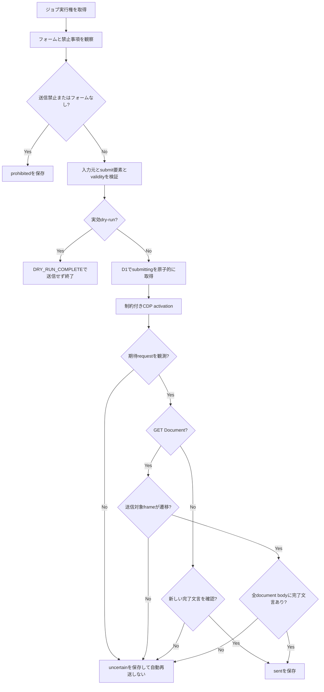

# Form Agent 残タスク・ハンドオフ

- 作成日: 2026-09-02
- 対象: `siu-issiki/form-agent` / `siu-issiki/form-agent-test-system`
- 再開時の推奨: まず「GET送信完了文言を送信対象frameへ限定する」から着手する

## 引き継ぎ概要

WorkerからOpenAI Responses APIとBrowserUse CloudのCDPを直接利用するproduction構成は稼働済みである。常設テストシステムの13シナリオは最終検証で期待結果に到達した。外部の実サイトには送信していない。

次の実装優先度は、GETフォームの完了判定を送信対象frame内へ限定すること、その次にsubmit gate外のGET型副作用を防ぐ設計である。どちらも現在は残存リスクとして設計書に明記している。

> [!CAUTION]
> productionの`AGENT_DRY_RUN`は`false`であり、通常ジョブは実送信する。外部サイトを対象にしたジョブ登録・再実行は、明示的な承認なしに行わない。送信なし検証ではジョブpayloadへbooleanの`_formAgentDryRun: true`を必ず指定する。

## 区切り時点の確認済み状態

| 対象 | 状態 | 根拠 |
| --- | --- | --- |
| Form Agent `main` | `1badee9`、`origin/main`と同期 | 設計書更新PR #44マージ済み |
| production Worker | version `47cb60f9-7113-489b-b451-4fdc53ac5bbf`を100%配信 | `wrangler deployments status`で確認 |
| production設定 | `AGENT_DRY_RUN=false`、`AGENT_MODEL=gpt-5.6-luna`、executor有効 | `wrangler versions view`で確認 |
| production active job | `pending` / `running` / `submitting`は0件 | D1を2026-09-02に再照会 |
| Test System `main` | `020e55c`、`origin/main`と同期 | main `e61e339b-a99b-4470-9980-c78bed894309`、external `5abda8af-0f1e-47a6-8b60-cf32c2fe64dd`を各100%配信 |
| 管理下E2E | 送信11件は`sent`・受信各1件、送信禁止2件は`prohibited`・受信各0件 | 最終実行は各1 attempt |
| 外部実サイト送信 | 未実施 | AnyReachはdry-runのみ |

productionのversion、binding、active job、Queue状態は時点情報である。再開時に必ず再照会する。

## 採用済みの設計判断

- 1ジョブを1社に限定し、QueueとD1の条件付き更新で実行権・送信権を制御する。
- `submitting`または`sent`へ到達したジョブは自動再送しない。送信後の結果が確定できない場合は`uncertain`で停止する。
- モデルへ汎用CDPやJavaScriptを渡さず、`navigate`、`observe`、`click`、`fill`、`select`、`submit`、`finish`だけを公開する。
- `fill` / `select`の実値はD1の`payload.formValues`から信頼済みhandlerが解決し、モデルへ生値を渡さない。
- submit controlは通常の`click`から除外し、`submit` toolだけで扱う。DOM activationを優先し、必要時だけmouse / Enterをモデルが選ぶ。
- 非safe methodは期待するaction URLとmethodを、GET submitはorigin、path、`Document` resource、送信対象frameを照合する。
- 外部フォームhostはジョブ単位の完全一致`allowedHosts`で許可する。共有の広域allowlistにはしない。
- dry-runでも`submit` toolは公開したまま、入力・submit要素・native validityを検証後、送信権取得とbrowser submitの前にearly-returnする。
- `prohibited`のreason codeは`NO_FORM_PRESENT`、`SALES_PROHIBITED`、`FORM_PURPOSE_INCOMPATIBLE`だけを許可する。
- agent tool診断には固定のtool、stage、result code、turnだけを保存し、URL、フォーム値、自由記述エラーを保存しない。

## 現在の送信確定フロー



`AnyBodyConfirmation`が最優先の既知ギャップである。送信対象frameの遷移は確認しているが、完了文言の集計はtop documentと全iframeを合算している。

## 管理下production E2E

| 期待結果 | シナリオ | 最終結果 |
| --- | --- | --- |
| `sent` | `native-post-redirect`、`native-get`、`multipart-post`、`ajax-inline`、`controlled-inputs`、`multi-step`、`open-shadow-dom`、`closed-shadow-dom`、`external-iframe`、`offscreen-submit`、`internal-page-form` | 各1 attempt、受信各1件 |
| `prohibited` | `email-only`、`sample-request-only` | 各1 attempt、受信各0件 |

初回検証では次の問題を発見し、修正後に新しいジョブで再検証した。同じ失敗ジョブを自動再送していない。

| シナリオ | 初回の観測 | 対応 |
| --- | --- | --- |
| `internal-page-form` | リンクをモデルへ返せず、受信0件で停止 | 許可済みサイト内リンクを全DOMから抽出 |
| `external-iframe` | 受信1件だが完了確認できず`uncertain` | iframe document bodyも完了確認対象へ追加 |
| `native-get` | 受信後にrequestまたは完了確認を確定できず`uncertain` | 期待GET Documentと同一frame遷移を観測 |
| `multi-step` | BrowserUse / CDPの一時失敗、受信0件 | 新規ジョブで再実行し1 attemptで成功。恒久原因は未特定 |

管理下テストは実送信である。受信先は常設テストWorkerだけに限定し、シナリオごとに1件ずつ実行できる。`uncertain`になった場合は、再実行前にテストシステム側の受信件数を照合する。

## 残タスク

| 優先度 | タスク | 完了条件 | 主な確認箇所 |
| --- | --- | --- | --- |
| P0 | GET完了文言を送信対象frameだけで確認する | 別frameにだけ完了文言がある場合は`uncertain`、送信対象frameにある場合だけ`sent`。`native-get`と`external-iframe`を再検証 | `src/browser-use-cdp-driver.ts`、`src/browser-use-cdp-dom.ts`、`test/browser-use-cdp-driver.test.ts` |
| P0 | submit gate外のGET型副作用を防ぐ方式を決める | 対象ドメイン／サブドメインとjob固有`allowedHosts`で、非submitの`click` / `navigate`から副作用endpointを起動できず、通常ページ遷移は維持 | `src/browser-network-policy.ts`、`src/restricted-browser.ts` |
| P0 | 禁止判定と送信前確認の信頼境界を追加する | Agentの自己申告だけでなく、禁止根拠と送信直前の対象・入力・回数を信頼済みhandlerが検証できる | `src/responses-agent-executor.ts`、`src/browser-tool-handler.ts` |
| P1 | `submitting`中のWorker強制停止を検証する | 管理下フォームで停止後も状態が`submitting`に残り、Queue再配信で受信件数が増えない | `src/job.ts`、`src/worker.ts`、`docs/operations.md` |
| P1 | production送信なし5並列を計測する | `_formAgentDryRun: true`の5ジョブで二重実行なし。OpenAI / BrowserUseのrate limit、session、時間、概算原価を記録 | `wrangler.jsonc`、D1 events、BrowserUse管理情報 |
| P1 | observabilityを拡張する | token、全体処理時間、BrowserUse待ち時間、費用を秘密情報なしでジョブ単位に追跡可能 | `src/d1-job-store.ts`、D1 migrations |
| P2 | 運用APIを追加する | 利用者別認証・権限、ジョブ一覧・キャンセル、`submitting` / `uncertain`照合を提供 | Worker HTTP API、D1 schema |
| P2 | 実サイト互換性を分類する | cross-origin iframe、確認画面、複数ページ、Shadow DOMを外部実サイトで段階検証し、添付・CAPTCHA方針を決定 | 明示承認後のみ実施 |
| P2 | 外部host抽出運用を検証する | CSV由来hostとredirect hostがジョブ単位の完全一致allowlistになり、別ジョブへ共有されない | `src/campaign-import.ts`、`test/campaign-import.test.ts` |

## 再開手順

### 1. 読み取り専用で現在地を再確認

```bash
cd /Users/siu/ghq/github.com/siu-issiki/form-agent
git status -sb
git log -5 --oneline
./node_modules/.bin/wrangler deployments status --json
./node_modules/.bin/wrangler versions view <ACTIVE_VERSION_ID>
./node_modules/.bin/wrangler d1 execute form-agent --remote --command \
  "SELECT status, COUNT(*) AS count FROM jobs WHERE status IN ('pending','running','submitting') GROUP BY status;"
```

production状態は本資料のversionを信用せず、その場で再確認する。

### 2. ローカル検証

```bash
bun run typecheck
bun run lint
bun run test
./node_modules/.bin/wrangler deploy --dry-run
git diff --check
```

現時点の基準はunit 86件、Workers 49件である。件数が増減した場合は、成功件数だけでなく削除・skipの有無を確認する。

### 3. PRレビュー

リポジトリの`AGENTS.md`に従い、PR作成後にサブエージェントへPR差分の読み取り専用レビューを依頼する。High / Criticalは必ず修正し、関連チェックと再レビューを行う。PRタイトルとブランチ名にエージェント由来のprefixを付けない。

### 4. 管理下フォームを1シナリオだけ再検証

以下はproductionから常設テストシステムへ実送信する。外部実サイトには使用しない。

```bash
cd /Users/siu/ghq/github.com/siu-issiki/form-agent-test-system
read -rs TEST_SYSTEM_API_TOKEN
echo
read -rs FORM_AGENT_JOB_API_TOKEN
echo
export TEST_SYSTEM_API_TOKEN FORM_AGENT_JOB_API_TOKEN
bun run test:production native-get
unset TEST_SYSTEM_API_TOKEN FORM_AGENT_JOB_API_TOKEN
```

引数なしの`bun run test:production`は13シナリオへ順次実送信するため、単一シナリオでの確認前には実行しない。

## 重要なコード・資料

- [`docs/architecture.md`](architecture.md): 現行構成、制約、残タスク
- [`docs/operations.md`](operations.md): Queue停止、D1 migration、緊急停止・再開
- [`src/browser-use-cdp-driver.ts`](../src/browser-use-cdp-driver.ts): DOM探索、activation、request観測、完了確認
- [`src/browser-use-cdp-dom.ts`](../src/browser-use-cdp-dom.ts): form、frame、Shadow DOM、body、link探索
- [`src/restricted-browser.ts`](../src/restricted-browser.ts): job状態とbrowser toolの信頼境界
- [`src/browser-network-policy.ts`](../src/browser-network-policy.ts): host / method制限
- [`src/responses-agent-executor.ts`](../src/responses-agent-executor.ts): Responses loop、tool schema、reason code
- [`src/d1-job-store.ts`](../src/d1-job-store.ts): 状態遷移、retry / DLQ / agent tool診断
- [`form-agent-test-system/src/scenarios.ts`](../../form-agent-test-system/src/scenarios.ts): 13シナリオ定義
- [`form-agent-test-system/scripts/run-production-suite.ts`](../../form-agent-test-system/scripts/run-production-suite.ts): production照合条件

## 実装履歴

- [PR #38](https://github.com/siu-issiki/form-agent/pull/38): 送信禁止理由コードを正規化
- [PR #39](https://github.com/siu-issiki/form-agent/pull/39): 許可済みサイト内リンクを観測
- [PR #40](https://github.com/siu-issiki/form-agent/pull/40): iframe内の送信完了を確認
- [PR #41](https://github.com/siu-issiki/form-agent/pull/41): GETフォーム送信を観測
- [PR #42](https://github.com/siu-issiki/form-agent/pull/42): 送信完了スナップショットを記録
- [PR #43](https://github.com/siu-issiki/form-agent/pull/43): GETフォームの送信完了を確認
- [PR #44](https://github.com/siu-issiki/form-agent/pull/44): 管理下E2Eの検証結果を設計書へ反映

## 未確定の運用判断

- 外部実サイトへの送信対象、承認者、1回・1日あたりの件数上限、緊急停止条件
- 営業禁止判定の基準、証跡、監査方法
- 個人情報、送信本文、ログ、DOM情報の保存期間とマスキング方針
- OpenAI / BrowserUseの月額・ジョブ単価の監視方法と上限
- CAPTCHA、ファイル添付、利用規約で自動操作が制限されるサイトの扱い

これらは技術実装だけでは確定しない。外部実サイト検証や並列数引き上げの前に、担当者と承認条件を決める必要がある。
